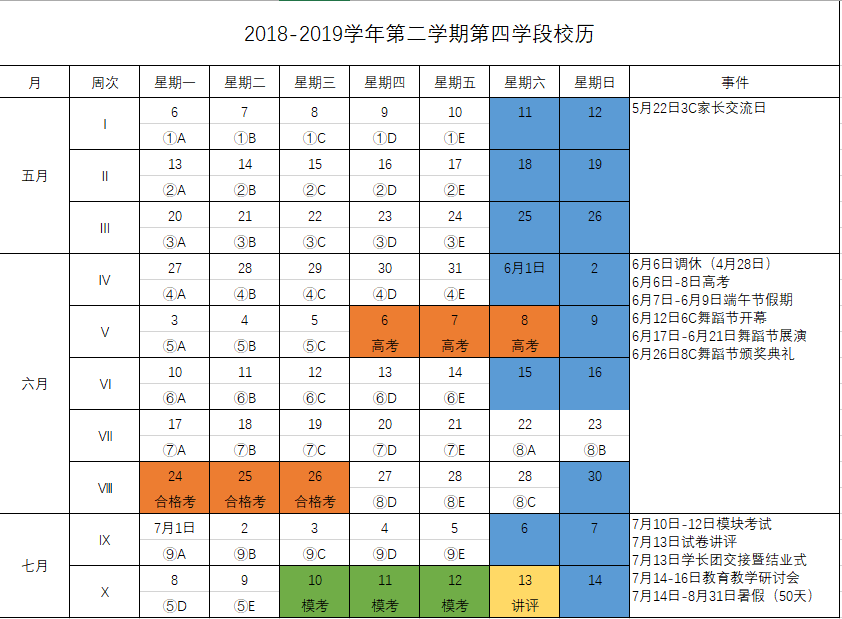

---

permalink: index.html
title: 主页
description: 官网维护期间的临时导航站

---

> 通知：
>
> 在校师生可通过**校内网络**访问[学校官网](http://www.pkuschool.edu.cn/)。使用外网**无法**访问学校官网。
> 学校官网关闭期间**不影响**校外网络对学校系统的访问。
>
> 使用期间如出现访问问题，可联系信息中心老师：
>
> - 金严：<jinyan@pkuschool.edu.cn> 186-1845-9215
> - 刘珺：<liujun@pkuschool.edu.cn> 136-0106-7996

---

- [单点登录](http://bdfz-cas.pkuschool.edu.cn/)
- [内网](http://portal.pkuschool.edu.cn/)
- [邮箱](http://mail.pkuschool.edu.cn)
- [OA](http://oa.pkuschool.edu.cn/)
- [Office 365](https://portal.office.com)
- [清华教育平台](http://course.pkuschool.edu.cn/)
- [高中希悦](http://bdfz.seiue.com)
- [初中希悦](https://passport.seiue.com/login?school_id=62&chosen=1&force=1)
- [初中龙创登录](http://cms.pkuschool.edu.cn/cz/)
- ~~[学生手册](http://www.pkuschool.edu.cn/shouce/xiaoli_01.html)~~ 学生手册受官网影响，也无法访问

本学段校历：

针对此网页的反馈：<shenjunyang@i.pkuschool.edu.cn>, <liuyuchen1@i.pkuschool.edu.cn>
